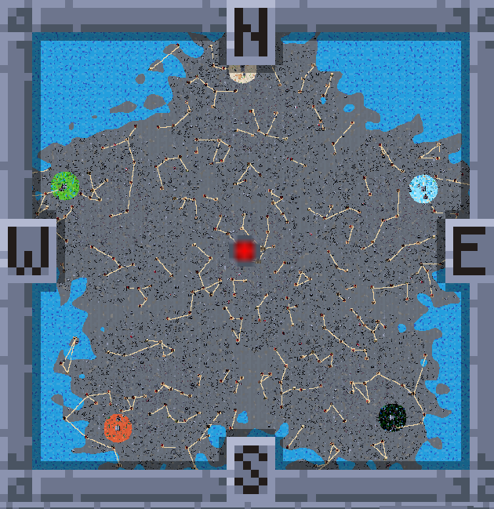
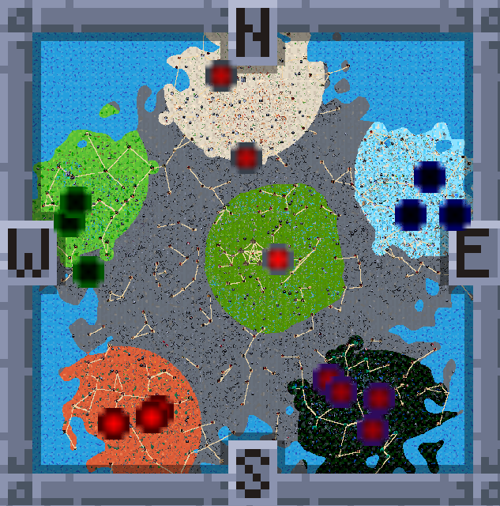
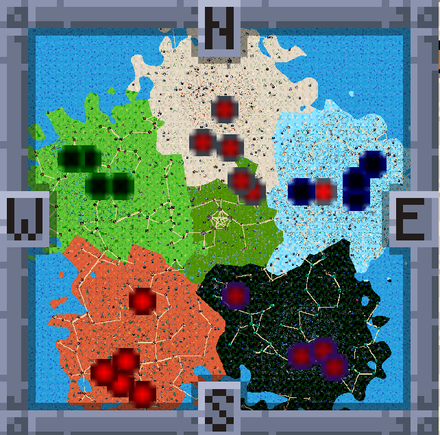

# The Forsaken Realms — Game Guide & FAQ

*A standalone card-adventure game built on the Forge rules engine.*

This guide walks through what's different about The Forsaken Realms compared to the base
Adventure experience, how the plane's custom systems fit together, and what to expect as you
explore. It's meant to sit alongside the game, not replace discovering things yourself — read as
much or as little as you want before diving in. Quick answers to the questions players ask most
are in the [FAQ](#faq) at the end.

## Table of Contents

1. [Introduction](#introduction)
2. [What's New in 1.17](#whats-new-in-117)
3. [Starting Out](#starting-out)
4. [Changes from the Base Game](#changes-from-the-base-game)
5. [Early Game Advice](#early-game-advice)
6. [Mid and Late Game Advice](#mid-and-late-game-advice)
7. [The World](#the-world)
8. [Dungeon Guide, by Color](#dungeon-guide-by-color)
9. [Item Guide](#item-guide)
10. [Notes on Difficulty](#notes-on-difficulty)
11. [Appendix: Mechanics in Detail](#appendix-mechanics-in-detail)
12. [FAQ](#faq)
13. [Support & Community](#support--community)

---

## Introduction

The Forsaken Realms grew out of stock Forge Adventure mode, but changes how the world
itself behaves: towns take sides, dungeons come and go, your reputation with each color actually
means something, and there's a real path from "wandering duelist" to "ruler of your own Capitol."
None of it requires you to play differently deck-wise — it's a layer on top of the normal
duel loop, not a replacement for it.

**Fair warning: this is a HARD game, and that's intentional.** You start with little, the world
doesn't wait for you, and losses have teeth. Digging yourself out is the fun — but go in knowing
the early game is meant to be a fight.

*Windows, macOS and Linux launchers all ship (Windows is the tested one), and every release includes an Android
version - playable, but it gets far less testing than the desktop builds.*

## What's New in 1.17

The short version for returning players. Each item links to where the guide covers it in full.

- **Enemies learn your tricks.** Beat the same enemy enough times in a row - five on Normal, four on Hard,
  three on Insane - and from then on it starts each duel with a **Wastes** in play, until it beats you once and
  its count starts over. Not on Easy. **Archmages** now start every duel with a Wastes too (not in town, Ring City, capital or Capitol fights,
  or Inn tournaments). See [Notes on Difficulty](#notes-on-difficulty).
- **New Game+ asks what comes along:** cards only, cards and the resources you carry, or those plus a refund
  of what you invested in the towns and buildings you still hold - and whether to keep your items. Every
  New Game+ starts with exactly five coins, and your roaming guards hand back their decks and gear. See
  [New Game+](#new-game).
- **Well over a hundred dungeons, caves, castles and lairs have new map pictures** - the old front-view caves
  are now three-quarter-view caves of their own land.
- **Each kind of dungeon at its share of the map** - no more clusters of one kind. Existing worlds rebalance
  once on load.
- **The Bronze Coin button shows the gold it saves** on the "Card Lost" screen.
- **Arena-only sets are out:** MTG Arena's digital-only sets (Alchemy and the other cards with perpetual,
  seek or conjure) no longer turn up in shops, boosters, rewards or enemy decks. To play with them, tick
  **Allow digital-only cards** in Settings (just below the Alchemy variants option) and restart; the choice is kept
  in your own profile, so updates don't undo it.
- **A quest that sends you to a boss lair that has vanished brings the lair back.**
- **The map:** decoration lies under you, a town outside the center has one road into the Ring Cities, and the
  water line along some land borders is gone.
- **Engine:** Forge 2.0.16 (the 10.01 build).

## Starting Out

- **Race selection** decides your hero's look, your starting expansions (four per race - how many
  you start with depends on difficulty - and the cards your starting deck is built from) and two
  starting shops. Your color comes from the Color picker. A `?` help button on the race-selection
  screen explains what each race actually grants before you commit. Twenty races, including the
  Goblin, Angel, Merfolk and Vampire - the full list is in [Races](#races).
- **Difficulty** affects more than combat: enemy roaming-encounter tiers, what buildings and
  research cost, what your cards sell for, and how many editions you start with unlocked are all
  difficulty-scaled.
- **You start with next to nothing.** You wake in a cave a short walk from **Orazca**, the ruined
  town at the heart of the map, with a **Homeward rune** that will always carry you home. The
  opening quest, "Oaths at the Ring", sends you around the five **Ring Cities** that circle Orazca,
  and each hands over part of your starting kit: gold, Shards, Wood, Stone, your starting items and
  your Challenge Coins. (Skip the introduction and you get the whole kit at once.) Starting gear with
  a slot of its own - Leather Boots, say - goes straight on if that slot is empty.
- Your starting deck is a real, playable toolkit — expect to reshape it as you loot and buy cards,
  not to carry it unmodified into the late game.

## Changes from the Base Game

### Reputation & Color Alliances

Every color tracks its own reputation toward you, independent of the others. Reputation moves in
five tiers - **Partner** (80+), **Happy** (30-79), **Neutral**, **Unhappy** (-30 to -79), and
**War** (-80 and below) - and each tier changes real things: card-shop pricing (30% cheaper as a
Partner, 40% pricier at War), how often that color's mages target you, and whether you can enter
their towns at all. At War, ordinary towns bar you (you can storm them instead) and a color's own
capital charges a steep gold toll just to set foot inside.

Your standing with a color also shapes what you'll run into on its land. Roaming enemies there skew
noticeably weaker with a Partner or Happy standing and tougher the worse things get, down to War; the
color's own creatures make up three times their usual share of what you meet at War and a third of it
as a Partner; and the worse your standing, the more of what you meet comes from the land itself rather
than its dungeons (see [Where the Monsters Come From](#where-the-monsters-come-from)). Only Unhappy and
War land holds [Legends](#legends), and at War a color also sends its own arena champions roaming. Your
own territory is always the safest place to fight, regardless of anyone else's standing. Separately,
the world as a whole trends toward tougher roaming enemies the longer a run goes on, week by week,
capped well short of an endless escalation - so the opening weeks are the gentlest part of any run, by
design.

The numbers behind all of this are in [Color Reputation, in Detail](#color-reputation-in-detail).

### Territory Control & Color Defeat

Towns aren't static. Each color's territory expands or contracts around its castle, capital and
towns over time, and whose land you're on changes your travel speed: 15% faster on your own, and
on a color's land anywhere from 10% faster (Partner) to 10% slower (War). Push a color all the way
to **War** and you can take the fight to it: storm one of its towns (once a week per town) and a
win makes the town yours, or storm its capital against two Archmages at once - taking a capital
halves the war mages that color can field. Bring down a color's **castle** by beating the Lord
inside and the color falls for good. Mind the castle's champion on the way in: one of the color's
own Archmages walks the ring of paths around the keep, notices you from five tiles off and gives
chase - two of them on Insane, always on opposite sides of the ring. Once the color falls, the
consequences ripple outward: its towns and capital
revert to the neutral Wasteland, the two colors beside it on the wheel each send their next mage
straight at you, and every surviving color can field one more mage from then on.

Here is how that looks on the world map, at three moments of one game. (These shots predate the
mountain barrier described under [The World](#the-world), but the colors spread the same way.)

**Day one.** The Forsaking left the land a gray Wasteland. Each of the five colors holds only the ground
around its Capital on the rim - white to the north, blue east, black south-east, red south-west, green west -
and you begin in the middle.

**A few weeks in.** Every color has pushed out from its Capital, and your own realm - the circle in the middle -
has grown around your Capitol. The blurred dots are mages on the march, each in its color's hue (black's are
purple); a dot inside someone else's land is an attack on its way.

**Late in the game.** The Wasteland is gone. Every border now touches another, and the frontier towns are
where the colors - and you - fight it out.

### Winning and Losing

Losing a duel never ends a run - it costs gold, life and your ante (see
[Notes on Difficulty](#notes-on-difficulty)). A run has one way to win and three ways to lose:

- **You win** by holding all five **Ring Cities** *and* bringing down all five colors' castles. You
  can keep playing afterward. A Ring City held by an AI color challenges you at its gate, whatever
  your standing: two of its champions fight you at once.
- **You lose if your Capitol falls.** A war mage that gets past your Capitol's guards forces you
  into a best-of-three defense duel, wherever you are. Lose it and the run is over.
- **You lose if one AI color holds three of the five Ring Cities.** You get a warning the moment
  any color holds two.
- **You lose if no free town is left:** you hold no town and no Capitol, and an AI capture leaves
  no wasteland town anywhere - no working or ruined one, and no unclaimed Ring City - for you to
  take.

A defeat screen then returns you to the main menu.

### Time, Day & Night

The Forsaken Realms runs on a living clock. Every in-game day the world ticks forward: territory
spreads, mages march, shops restock on their weekly cycle, mines pay out and guards draw their
wages on payday (the first day of each new week - days 8, 15, 22 and so on), quest timers count
down (see [Quests](#quests)), and dungeons age toward their rotation. A HUD clock shows the time of
day and a Day/Week tracker keeps the calendar visible. The tracker counts the day within the week
(1-7) and numbers the weeks from 0, so day 8 shows as "Day 1, Week 1". When this guide says "week 1",
it means days 1-7 - the HUD's Week 0.

A **Speed-Up** toggle fast-forwards time when you're waiting on the world rather than exploring it
(holding **Z** speeds things up too). Monsters keep pace with the clock: a game day brings the same
number of them at any speed, and new ones stop coming while about 14 are already roaming within 24
tiles of you, so the screen never fills up.

Day and night change the fights themselves. Between **6am and 6pm**, enemies you battle on the
overworld get a life bonus or penalty based on the terrain you fight them on - and the effect
flips at night:

| Terrain fought on | Day (6am-6pm) | Night |
| --- | --- | --- |
| White (plains)    | +10% life | -10% life |
| Green (forest)    | +5% life  | -5% life  |
| Black (swamp)     | -10% life | +10% life |
| Red (mountain)    | -5% life  | +5% life  |
| Blue / neutral / your land | no change | no change |

In practice: raid the swamps at high noon and the plains after dark. The modifier applies only to
roaming overworld fights - dungeons, towns, Arenas, and Inn tournaments are unaffected.

### Fog of War

Fog of War is on by default (Settings can switch it off). **Black** is land you have never
explored, **dimmed** is land you have seen but can't see right now, and **bright** is what's in
view: the circle around you, your own land and towns, an Outlook's reach, a Bonfire's light.
Creatures only show in the bright, and so do the resource pickups (gold nuggets, wood, stone and the
rest), which come and go on ground you only remember. The marker on a place you haven't visited dims
with the fog around it.

A town, capital or castle lights up the land around it for a few seconds each time you come within
reach of it - not only the first time - and again when you leave it, so you can get your bearings.
Your own towns stay lit for good.

The fog also changes what you meet. Where you can't see right now - dimmed or black - roaming
creatures turn up more often, lean toward the tougher ranks, and move 10% faster. In the light they
come less often and the mix leans easy. Your own light counts, so a Torch pushes the danger back -
and a creature chasing you slows down as it steps into your light. (With the fog switched off, the
whole map counts as lit.) The [Item Guide](#item-guide) covers the Torch and the Bonfire.

### Where the Monsters Come From

Most of the creatures roaming the realm come out of its **dungeons and caves**. Every ordinary
dungeon or cave on the map - whether you've found it or not - sends creatures into the land around it
while it stands. The land itself adds only a share of its own:

| Land you stand on | The land's share | The dungeons' share |
| --- | --- | --- |
| Your own land | 15% | 85% |
| The Wasteland | 25% | 75% |
| A color's land, Partner | 15% | 85% |
| A color's land, Happy | 20% | 80% |
| A color's land, Neutral | 25% | 75% |
| A color's land, Unhappy | 30% | 70% |
| A color's land, War | 40% | 60% |

- **Reach.** A dungeon pulls at full strength within about 10 tiles and fades out by about 28. Several
  dungeons close together don't add up beyond one at full strength, but with none in reach only the
  land's own share comes - so **clear the dungeons around you and the land there goes quiet.**
- **Which creatures.** A dungeon you haven't been inside sends ordinary creatures of its color. Once
  you've been in, it sends the very creatures that live there - the weaker ones first, the stronger only
  as the weeks go by. They come at you from the dungeon's side, at the usual distance.
- **It grows.** Each full week a dungeon stands adds a quarter to what it sends, up to double.
- **Clearing it** - beating every enemy inside - silences it for good, and the nearest town is grateful:
  +1 town reputation.
- **What doesn't count.** Story places, boss lairs and castles don't send creatures, and what comes out
  is never a dungeon's boss, its champion or anyone you could talk to.
- **Roads.** While you travel a road, the land itself sends nothing new, but the dungeons in reach still
  can.
- **Quest creatures are separate.** A creature a quest asks you to defeat - an invasion to stop, a
  creature to hunt - gets a roll of its own every time, wherever you are: on a road, on your own land,
  near dungeons or far from them.

The "Find a Dungeon" quest early in the story explains the same thing in the game.

### Legends

**Legends** - the realm's oversized dragon lords, gods and Slivers, and the Arena's wandering
champions, many of them best-of-3 fights - have a table of their own, separate from everything else
that roams.

- **Where.** Only on the land of a color that is **Unhappy or at War** with you. A legend walks a
  color's land when it carries that color; the few colorless ones walk any hostile land. Never on your
  own land, the Wasteland, or a Neutral, Happy or Partner color's land.
- **How often.** Rarely: about one sighting every three days of travel on Unhappy land and one every day
  and a half at War, with at least two days between sightings and only one legend out at a time.
- **Which one.** The ones you haven't met come first - a legend you have already seen returns only once
  the others have had their turn - and the same legend is never out twice at once.
- **The sighting.** A legend never arrives unannounced: you are told which one it is and in which
  direction, a **gold dot** marks it on the minimap and the map, and your quest log lists every legend
  roaming right now with its direction and the days it has left. It appears 12-20 tiles away and **holds
  its ground for three in-game days**: it only comes for you once you walk within about 5 tiles, and lets
  you go once you're 8 tiles off - so the fight is yours to pick.
- **The duel.** A legend you meet on the overworld starts its duels with a **Gemstone Mine** in play.
- **The reward.** A legend pays half the gold and two thirds of the cards on its reward list (its own
  named card is the last to go); shards, items and +Life rewards are paid in full.

The legends include the twelve added in 1.16: the Seraph of the Burning Brand and the Sunscale Dragon
(white), the Skyvault Dragon and the Sixblade Naga (blue), the Nightscale Dragon and **Victor**, the vampire
Archmage (black), the Pyreclaw Dragon and the Cinderstone Brute (red), the Thornscale Dragon and the Bogspawn
Horror (green), and the colorless Ossuary Dragon and Blightborn Mutant.

### The Capitol

Your Capitol can rise in one place only: **Orazca**, the ruined town at the very center of the
map. Restore it at its Job Board like any other ruin, hold five towns in all (Orazca counts), and
the same Job Board offers the upgrade. The Capitol is a walled, castle-sized town with a layout of
its own, two guards instead of one, and **24 building slots** - 16 open ones plus five colored Land
Shops, a Utility Land Shop, a Booster Shop and an Armory, against an ordinary town's 9 (8 open
slots and an Armory). It also offers buildings no ordinary town does: the Bank, the Exchange, the
Archaeologist, the Research Lab, Rare and Mythic card shops, and an Arena you can upgrade.
Upgrading carries Orazca's reputation, buildings and guards forward, and adds +2 town reputation
on top for good measure. The Capitol's Job Board offers the usual town quests and the Capitol's own, such as
finding the five AI capitals.

Raising it draws fire. The moment your Capitol stands, every color still in the game sends an
Archmage at your realm, and for as long as it stands each color may keep one more attack mage in
the field.

**Your roads.** Raising the Capitol also paves your realm: cobblestone roads join it to every town
you hold (captured Ring Cities included), taking over the old sand roads wherever they already run,
and every town you restore or capture later joins the network. Any road speeds you up, but your own
are faster still - about 1.7x your normal pace against the old roads' 1.5x, and the extra is yours
alone. The Capitol sits on a cobbled plaza six tiles wide and five deep, each of your towns on one five
wide and four deep.

### Wood & Stone

Beyond Gold and Shards, you'll collect **Wood** and **Stone**. They come from winning duels
(Green enemies lean to Wood, Red ones to Stone - see below), from world-map resource sparkles and
dungeon pickups, from chests and quest rewards, and - once you own a town - as steady weekly income
from a Lumber Mill or Stone Mine. They're spent on building and upgrading structures, and on the
Capitol upgrade itself.

### What a Win Pays

Roaming and dungeon enemies pay by **rank** - Apprentice, Adept, Master, Archmage, shown in the
enemy's name - and your **first victory** over each kind of enemy is the big one.

- **Cards.** A repeat win pays 1 / 2 / 2 / 3 cards by rank. A first victory pays 2 / 3 / 4 / 5,
  keeps the best rarities the enemy rolled, and adds one more non-land card from its deck (Common
  or Uncommon; Rare too on Easy). Masters and Archmages always keep their best cards first; an
  Apprentice or Adept pays at random on a repeat win. Gear that adds reward cards still adds them,
  and Easy pays one more card per win. A payout never hands you the same card twice while there is
  something new to give: when the enemy's deck runs out of new cards, the rest come from the sets of
  the enemy's color, in its deck's colors. A second copy, or gold, is the last resort.
- **Gold and resources.** Every win pays gold plus, usually, one bonus resource that leans to the
  enemy's color: **White** to more Gold, **Blue** to Shards, **Red** to Stone, **Green** to Wood.
  **Black** is balanced, an enemy of two colors leans both ways, and a **colorless** one is
  balanced with a smaller purse. The purse grows with rank, is half again as large on a first
  victory, and a quarter larger when you beat an enemy that had the better record against you. So
  hunt the color whose resource you need. A color's "defeat five" quest counts those kills wherever
  they happen, out in the wilds or down in a dungeon.
- Bosses, tournament opponents, chests and quest rewards pay what they always did. An Arena
  champion you beat pays one Rare card from its deck. A [legend](#legends) pays half its gold and two
  thirds of its cards.
- A **champion met outside the Arena** - a cave's champion, or a color's war champion roaming its land
  at War - pays twice what an ordinary enemy of its rank pays for a first win: twice the cards, best
  rarities first, and twice the purse, plus its own signature card when it has one.
- Every number here is a setting: `cardBudget...` (1 to 5 cards each) and `resourcePurse...` in
  the plane's `config tables/settings.json`.

### Buildings & the Economy

Towns you restore can be built up with dedicated economy buildings: **Gold/Wood/Stone/Shard
Mines** for steady weekly income, a **Trader** (any town, including your Capitol) for converting
Gold into Wood/Stone at a markup, a **Bank** and **Exchange** (Capitol-only - a Trader built at
your Capitol can also be upgraded into an Exchange, which trades at better rates and adds
Shards - the Exchange takes over the Trader's slot, so a town has one or the other, never
both), an **Outlook** (expands your fog-of-war vision radius - 2x in a town, 3x in your
Capitol), a **Teleporter** network for fast travel between any two Teleporter-equipped locations,
and an **Archaeologist** who can be sent on week-long expeditions for a chance at boosters and
rare items. Guards can be hired to defend a town, paid weekly out of your own coffers.

**Restoring a town.** A ruin's Job Board offers the restoration. The fee grows with your realm: 200 gold and 20 wood
while you hold fewer than five towns, then 50 gold and 10 wood more for every five you hold (250 + 30 from five
towns, 300 + 40 from ten, and so on), scaled by difficulty like every other cost (Easy 25% cheaper, Hard 25% and
Insane 50% dearer). Orazca, the Capitol and towns taken by force count; lose towns and the fee falls with them. Once it's paid you are sent back
out to the map - step back in and the town stands in your own town layout, its Inn open and its
other slots still rubble for you to build on. Ruins and neutral towns you don't hold keep the old
Wasteland look, and Orazca, once restored, keeps the Warden inside. A town you capture from a color
starts out the same way.

**Town reputation caps building.** Each point of a town's own reputation allows three buildings
there. You get +1 for restoring the town, +2 when it becomes your Capitol, +1 for each attacking mage
you beat there, +1 for winning its Inn tournament, +1 when you clear a dungeon near it, and more from
its Job Board quests. **Destroy Building** clears a slot, with no refund. A Capitol's colored Land Shop
can be repaired (50 gold) once you've visited that color's AI capital.

### Progressive Set Unlocks

Not every card set is available from turn one. Editions unlock gradually as you play (scaled by
your starting race and difficulty), and the **Research Lab** in your Capitol lets you formally
unlock the ones you have collected enough of. Research takes a week per edition, and several can
run at once. (Don't confuse this with the **Archaeologist**, who runs week-long expeditions for
cards and items - a different building doing a different job.)

**Your shops stock only what you have unlocked.** A card shop you build sells cards from the sets
*you* have unlocked - nothing else, and in a printing from one of those sets. Unlock more sets to stock
your shops. In return they sell cheaper than anyone else's: 25% under a neutral town's prices and 40%
under an AI town's.

*Full detail — what you start with, where the other sets live, and exactly how to unlock them —
in [Card Sets](#card-sets-what-you-have-and-how-to-get-the-rest).*

### Dungeons That Actually Rotate

Dungeons and caves aren't fixed forever. Every visible one has a lifespan - 20 to 40 days - after
which it despawns on its own (at once if you lose a fight there and it isn't a story target), and a
fresh one appears elsewhere to take its place, drawn from a much larger reserve pool than what's
ever visible at once. Clearing a dungeon out completely also retires it, making room for something
new - completely means every enemy and every pickup, on every floor of a dungeon with stairs. Beat
every enemy but leave loot behind and it waits for you to come back for the loot, with only a
quarter of the days it had left. Stripping its loot while its guards still stand also cuts it to a
quarter. Side-quest-linked dungeons get extra grace: three failed attempts before they're
gone for good, and 30 extra days while a quest still points at them. Story-critical locations never
disappear.

While an ordinary dungeon stands, it sends creatures into the land around it, more the longer it
stands - see [Where the Monsters Come From](#where-the-monsters-come-from).

Loot fights back, too: a chest or booster pack inside a dungeon usually has a guard of its own.
Grab it while the guard still stands and the guard comes after you - a little faster than you
walk. Loot behind a locked gate or door is the exception: the lock is its guard, so once you've
found the key, pulled the switch or beaten what opens it, what's inside is yours.

**Boss lairs** follow their own rule. A lair leaves the map only once you've beaten its boss and
walked out with nothing left inside - losing there doesn't make it vanish - and 10 to 30 days later
it comes back to the same spot, fully restocked. Return visits pay half the gold, resources and
cards; a +Life reward and the boss's own signature item pay only once, and every other item is a
coin flip - though a key you need to get deeper in always drops.

### Quests

- **Up to 10 side quests** can be active at once.
- **A side quest lasts 15 days** from when you take it, then fails (quests taken in an older version keep
  the 20 days they started with). Story quests never expire.
- **"Return to town" stages wait for you.** A bounty or reward that asks you to go back pays when you
  walk into that town - not wherever you happen to be. If the stage starts while you're already standing
  in the town, step out and back in.
- **The creatures a quest asks for come to you.** While a "defeat" quest is active, its creatures get their
  own roll every time new creatures appear - on roads and on your own land as much as anywhere. With
  several such quests, each gets an equal turn.
- **Invasions** (goblins, merfolk, the undead, elves, soldiers, orcs, giants, demons, knights, bandits and
  vampires) ask for a few wins against the invaders - 2 on Easy, 3 on Normal and Hard, 4 on Insane - then
  for their leader. The leader matches your rank, and comes one rank tougher once the town that asks has
  10 or more reputation with you. The reward grows with the leader's rank: 300 / 500 / 800 / 1,200 gold
  and 2 or 3 local reputation. A town won't offer the same invasion twice in a row.
- **Eviction Notice** sends you to clear one of the nearer dungeons or caves - a different one each time.
- **Svyelunite Temple**, on a blue shore, is a battle already under way between the Vodalian merfolk and the
  Homarids. Its heralds ask you to pick a side ("The Tides Give, the Tides Take"); beat the other side's
  fighters there for a reward that depends on whom you helped. It is found in worlds made from this version on.
- The **blue dot** in the quest list marks the quest you're tracking, and counting quests - "defeat five
  Blue enemies", "clear three dungeons" - show their progress there, "(2/5)".

### Ante, Tournaments & Hostile Lands

Ordinary duels are played for ante (on by default): each side stakes a card, winner takes it. If
you lose a card you value, a **Buy Back** option lets you repurchase it on the spot (priced by
rarity), and an escalating-cost **Re-roll** lets you swap out an ante you don't want to risk
before the duel starts — re-rolls won't repeat a card you just rejected. Or hand over a **Bronze
Coin** (the button on the "Card Lost" screen) - see [The Bronze Challenge Coin](#the-bronze-challenge-coin).

Innkeepers run weekly **tournaments** (Draft, Sealed, and - once per player - Jumpstart) — these
are entry-fee events with prize support, **no ante at stake**. They also offer an opt-in "simulate
the AI rounds" mode if you'd rather not watch every AI match play out. Details in
[Inn Tournaments](#inn-tournaments).

Beyond the tavern, remember the world itself takes sides: depending on your standing with each
color, their lands are more hostile or more friendly — travel speed, shop prices, town access,
and who their mages hunt all follow your reputation. And once you've built your Capitol, it hosts
an **advanced Arena** with a challenge tier (and champion fights) no ordinary town offers.
Arena fighters play their own decks, the same ones they'd bring to a fight in the wild. The
brackets at the five AI capitals, and at your own Arena until you upgrade it to level 2, never
seat Apprentice-tier fighters: about half the field are Adepts, a third Masters and the rest
Archmages. Win all three rounds at an AI capital and you take one item from that capital's own set of eight, in its
color's style - helper shoes, a Planeswalker amulet, a color ring, a mask, armor and weapons - and no two capitals
share an item.

### Item Economy & Shops

Shops restock on a weekly cycle (or sooner: the Refresh button re-rolls one for a few Shards, +1 for
each refresh that week), a card shop in your own town can be re-assigned to another type you know, and
prices differ depending on who's buying: your own shops sell to you under market, AI shops charge you a
premium. A shop with a single color in its name - a White Instant shop, a Black Vehicle shop, a Red
Sliver shop - sells only cards of that color. Rare items exist as genuine chase rewards, not just
vendor filler - several bosses across the world drop items nobody else carries.

### World Standings & Mod Details

Two dedicated info screens track the state of the world and the mod itself: a World Standings
page showing every color's current reputation and territory at a glance (with a running history
graph), and a Mod Details page documenting the custom systems in-game, without needing this guide
open in another window.

## Early Game Advice

Your starting deck is a foundation, not a finished product - expect to add and cut cards
constantly for the first several in-game weeks. The first two weeks are the gentlest the run will
ever be - monsters start their duels with less life - so use them to build up. Prioritize a town of
your own early - and make Orazca, the ruin at the center, one of the first, since it's the only place
your Capitol can rise. Even a small town gives you a Mine or two, a place to restock cards, and a
foothold toward the five you need for that Capitol. Watch your reputation with the color you're camped
nearest to - it's much easier to stay Happy than to climb back from Unhappy once shops start charging you
extra.

Clear the dungeons and caves near your towns. Each one you clear stops sending creatures into the land
around it and earns a point of reputation with the nearest town, and the longer a dungeon stands, the more
it sends.

Carry a light. The dark is where the tougher creatures come from, and they come more often
there; a Torch (your own Armory keeps one on the shelf until you've bought your first) doubles how
far you see and keeps more of the map around you lit.

Push toward your Capitol as early as you reasonably can - five towns is a real early-game
investment, but it's the only place a Trader can be upgraded into an Exchange, on top of unlocking
the Bank, the Archaeologist and the Research Lab outright. Build a **Trader** well before then,
even though its rates are worse than an Exchange's - it's a guaranteed early way to turn spare
Gold into the Wood and Stone your buildings actually need, instead of waiting on Mines or dungeon
loot alone. It's also a good home for Gold you don't need sitting in your pocket: a lost duel takes a
share of the gold you carry, and if you lose an ante duel and want the card back, Buy Back costs real
Gold, priced by rarity - costs that bite hardest on Insane, where you start with barely any cushion.
Gold you've already converted into Wood or Stone, or put in the Bank, isn't there to lose.

## Mid and Late Game Advice

By the midgame you should have a Capitol, at least one or two economy buildings generating
passive income, and enough reputation with your home colors to move through their territory
freely. The late game is about picking your fights: which colors you push toward War (and can
actually back up with a real deck - Unhappy and War land is where the legends walk), which capitals you're strong
enough to storm, and how far you push into the plane's hardest dungeons and boss fights. The run itself
is won by holding all five Ring Cities and bringing down all five castles - see
[Winning and Losing](#winning-and-losing).

## The World

The Forsaken Realms uses the standard five-color-plus-colorless biome layout: each color has its
own territory, its own AI-controlled capital and castle, and its own flavor of dungeon. The five
colors sit evenly around the center of the map, where **Orazca** - your future Capitol - lies in
ruins, ringed by the five **Ring Cities** (Benalia, Tolaria, Urborg, Shiv and Llanowar) and joined
to them by roads like the spokes of a wheel. A Ring City's shops sell every card set, at double
price. Between the colors' lands, and along the coasts, runs **the barrier**: mountain ranges that
no territory ever claims and no road crosses - you go around them, unless you can fly. (Worlds made
before v1.14 have no barrier.) Beyond the color biomes, the world is dotted with named landmarks
worth seeking out - ancient castles like **Von Gant's Fortress**, **Emrakul's Castle**, and
**Black Dragon Mountain**; strongholds like the **Djinn's Palace** and **Necromancer's Study**; and
quieter finds like **Grolnok's Bog** or the **Secluded Elven Encampment**. Not every location is
hostile - some are just worth the detour.

**Reading the map.** A thin black outline on the world map means you can't walk through it - trees,
rocks, water, mountains. The decorations without one - flowers, pebbles, bones, puddles - are all low
to the ground, and you walk right over them; none ever lies on a road or a plaza.

## Dungeon Guide, by Color

This isn't an exhaustive list (the world generates far more dungeons than any one playthrough will
see), but a starting point for what to expect in each color's territory. Every dungeon and cave has
an entrance picture of its own on the map, so you'll soon learn to tell them apart at a glance.

### White

Forts and camps dominate white territory - watch for **Kor Outposts**, **Pirate Forts**, and the
**Cloud Fort**. The newest addition here is **Peaceful Clearing**, a full dungeon housing seven
distinct boss encounters (Cerise, Emiel, Grakk, Kwain, Phelia, Preston, and Thurid), each with
their own custom deck and drops.

### Blue

Blue's territory leans heavily on caves and flooded ruins - the **Sea Temple**, **Deep Caverns**,
and **Djinn's Palace** among them. **Idyllic Beachfront** is the newest full dungeon here, home to
six new bosses plus a returning favorite (Plagon) now folded into the same fight.

### Black

Black territory is graveyards, cursed groves, and worse - **Grolnok's Bog**, the **Undead Grove**,
**Shade's Lair**, and **Emrakul's Castle** among the notable stops. Two new locations landed here:
**Eclipsed Elven Court**, a full seven-boss dungeon (including the previously-buggy High Perfect
Morcant fight, now fixed), and **Isolated Hut**, a smaller bonus dungeon built around a single
tough boss, Istvan.

### Red

Barbarian camps, mercenary outposts, and the **Furnace Host Base** define red's territory.
**Ashling's Domain** is the newest full dungeon here - five bosses (Ashling herself among them)
guarding one of the plane's toughest early fights.

### Green

Expect groves, forests, and the occasional cursed grove - **Garruk's Forest**, **Copper Host
Forest**, **Satyr Grove**. **An-Havva Inn** is the new full dungeon in green territory, with five
bosses including a rebuilt Autumn Willow encounter distinct from the plane's own pre-existing one.

### Colorless

Colorless territory holds some of the plane's strangest fights - the **Gitaxian Laboratory**,
**Autonomous Factories**, and now two new additions: the **Planeswalker Dueling Club**, a
seven-boss gauntlet (plus a joke encounter worth finding), and the **Ancient Opal Cavern** - a
single, brutally difficult best-of-three duel against Nephilim Epochal for the Mox Opal. Bring
your best deck.

### Legendary Dungeons

Nine locations stand apart from everything else on the map: the eight dungeons ported from the
Realm of Legends (Ashling's Domain, Eclipsed Elven Court, Planeswalker Dueling Club, Idyllic
Beachfront, Peaceful Clearing, An-Havva Inn, Ancient Opal Cavern, Isolated Hut) and the Eldrazi
Prison. These are **true endgame content** - their bosses and decks were built to a far higher
power level than the surrounding world, and they are deliberately not scaled down. You'll know
them by the **red triple-skull marker** on the minimap and a warning at the door. Treat them as
your character's final exams, not a mid-game detour.

### The Caves

**78 caves**, thirteen per biome - Frosthollow, Tidecutter Grotto, Bonepile Hollow, Cinder Hollow,
Mossback Hollow, Wasteland Cleft and their kin. Small, medium and large chambers with three to five
patrolling creatures - most of them small fry, but one or two in every cave can be anything from an
Apprentice to an Archmage, so look before you step in. Each holds a card chest, gold and building
stone; the deeper ones add wood, mana shards, a second gold pile and sometimes a booster pack. They
spawn in new worlds and join the dungeon rotation, and like every ordinary dungeon they send creatures
into the land around them until you clear them.

## Item Guide

Items are a real part of building your character, not an afterthought - between shop purchases,
dungeon rewards, and boss drops, expect to be actively hunting for upgrades throughout a run.
Several items exist only as drops from specific bosses and can't be bought anywhere, including a
wave of equipment tied to the plane's newest dungeons (boots, crowns, armor, and more, each
built around the specific card it grants you at the start of a fight). Check what a boss drops
before you commit to fighting them if a specific item is your goal.

**Your equipment slots.** The character doll on the inventory and Armory screens shows every slot you
have. Besides the usual ones - both hands, body, boots, neck, the medal and the staff slot - there are:

- **Two utility slots** for Runes, Omenstones, Torches and the Bonfire, so you can carry, say, a Torch
  and a rune at once. Two lights don't add up: only the stronger one counts.
- A **Blessing** slot (the Blessings of Speed, Windwalker's Blessing), a **Heart** slot (the Captive
  Souls), a **Pocket** slot (the Generous Ingot) and a **Token** slot (the Tokens of Bounty, Blades,
  Insight and the rest). These always worked; they now show on the doll, under the first ability slot and
  beside the medal.

Pick an empty slot and the screen tells you what goes there.

**Runes and Omenstones** are reusable teleports that cost a shard per use. Everyone starts with a
**Homeward rune**, which takes you home - to just outside Orazca, or your Capitol once it stands.
The Quick Travel Mart in your Capitol and your towns sells the Omenstones, the Ghost rune, and the
**Rally rune**, which carries you to just outside whichever of your towns - or whichever of the
five Ring Cities, whoever holds it - is under attack. With several besieged, each use goes to the
next one in turn, so four uses reach four places before the cycle starts over. While none of them
is targeted it does nothing and costs nothing. The main quest hands you your first one: hire a
guard for Orazca ("Raise the Banner") and the stage ends with a briefing on how guards fare against
attacking mages and a Rally rune to answer the next attack.

**Light in the fog.** A **Torch** (200 gold list price) doubles how far you see through the fog of
war, and a **Grand Torch** quadruples it; use either (1 shard) to flare your sight to three times
its radius for a moment, and everything the flare touches stays on your map. The **Bonfire**
(1,200 gold) lights the way like a Torch while you carry it. Use it on the world map (1 shard) to
build a fire where you stand: the fog lifts for 15 tiles around it, one tile less each day, until
the fire dies out two weeks later. A kit makes ten fires, and a spent kit is rebuilt for 50 Shards.
It needs Fog of War on - with the fog off, a use is refused and the shard handed back.

The **Yin-Yang rune** (2,000 gold) is two halves of one stone. Use it on the world map to set the
light half down where you stand, then use it again from anywhere under the open sky to return to
that spot and take the half back up - a teleport anchor you place yourself. One shard a use; inside
a town or dungeon it does nothing and the shard comes back. The Bonfire and the Yin-Yang rune are
Rare items: look for them in Armories.

## Notes on Difficulty

Insane difficulty roughly doubles the stakes of everything above: reputation swings matter more,
War states are more likely to actually happen, and the newest boss fights (several of which run
best-of-three) are tuned to be a real test even with a well-built deck. If you're finding a
specific new boss unfair, it's worth checking whether an easier difficulty changes that fight's
deck tier before assuming it's just you.

**Tougher ranks sooner on Hard and Insane.** As the weeks pass, more Adepts, Masters and Archmages roam,
and Hard and Insane get there sooner. In weeks 2-3 on open land, about 2 in 10 roaming enemies are Adept or
better on Normal, 3 in 10 on Hard and 4 in 10 on Insane. Week 1 never has Masters on any difficulty, and your
own land stays the quietest.

**What a lost duel costs.** Gold: a share of what you carry - 2% on Easy, 5% on Normal, 10% on Hard
and 15% on Insane - but at least 50 / 100 / 150 / 200 gold, or all of it if you carry less. (The
share takes over above 2,500 gold on Easy, 2,000 on Normal, 1,500 on Hard and about 1,330 on Insane.
Gold in the Bank is safe.) Life: 10% of your max life on Easy, 20% on Normal, 30% on Hard and Insane.
And your ante. Handing over a Bronze Coin on the "Card Lost" screen saves your gold and your anted
cards (the life loss still applies). If your life runs out you're carried home: to your Capitol, or to
Orazca before it stands. Losing inside a rotating dungeon usually makes that dungeon vanish.

**Enemies learn your tricks.** Beat the same enemy five times in a row on Normal, four on Hard or three on
Insane, and every duel after that it starts with a **Wastes** in play - a notice tells you the first time, as that
duel opens. It is always one Wastes, however long the streak runs. Easy is spared. It keeps that edge
until it beats you once (a Bronze Coin still counts as a loss); then its count starts over. The count is per
enemy, whichever of its decks it brings, and covers every duel but Inn tournaments and your guards' fights.
**Archmages** start every duel with a Wastes as well, except in town, Ring City, capital and Capitol fights
and Inn tournaments - so an Archmage on a streak starts with two.

**Notoriety: word of your wins spreads.** Win five duels in a row - against anyone - and from your sixth duel
on, enemies start with a **Wall** token in play: a 0/1 Wall from the 6th duel, 1/2 from the 11th, 2/4 from the
16th and 3/6 from the 21st. Keep winning and a **second Wall** joins it: from the 26th duel the enemy has the 3/6
plus a 0/1, and the second one grows the same way - 1/2 from the 31st, 2/4 from the 36th and 3/6 from the 41st on.
Every Wall has defender, so it blocks but never attacks; from the 1/2 on it also deals damage when it blocks.
Apprentices and Adepts bring plain Walls, Masters Walls with reach and Archmages Walls with flying. Which enemies do it
depends on the difficulty:

| Difficulty | Enemies that bring a Wall |
|---|---|
| Easy | Archmages |
| Normal | Masters and Archmages |
| Hard | Adepts, Masters and Archmages |
| Insane | Everyone |

Past that, two more Walls come for **every** enemy on every difficulty: a flying 3/6 Wall from your 46th duel, and a
second flying 3/6 from the 51st. Each also gives the enemy 25% more life - +25% from the 46th duel, +50% from the
51st. So on Insane an enemy facing a 50-win streak starts with four Walls and half again its life.

Word of a streak also draws stronger opponents. Every 5 wins in a row tilts the roaming spawns toward higher ranks
(fewer Apprentices, more Masters and Archmages), and from 30 wins in a row the toughest creatures of the land can come
out sooner than your total wins would allow. Dungeons and caves you enter for the first time feel it too: from 10 wins
in a row some of their creatures step up a rank, and from 20 some step up two - at 30 wins about one in four goes up a
rank and one in five goes up two. A place keeps what you found in it until it rotates away. Lose once and it all
starts over with your streak.

Each Wall card says why it's there, under a bold **Notoriety** line with the wins it stands for. Lose once (a Bronze Coin still counts as a
loss) and your streak starts over. It counts the same duels as an enemy's own streak above, except the Arena: an Arena
duel neither adds to your streak nor resets it, though Arena fighters still bring the Walls it has earned. New Game+
starts it from zero.

**The first two weeks are eased.** In week 1 (days 1-7) a monster starts its duel with half its life,
but never fewer than 20; in week 2 (days 8-14) with three quarters, never fewer than 25. A monster that
already has less keeps what it has. Bosses, legends, Arena and Inn fights, war mages and your guards'
fights are never eased, and neither is New Game+. A dungeon you've been inside also sends out its
stronger inhabitants only as the weeks go by.

Difficulty also scales what a win pays in gold and resources (half again as much on Easy, a quarter more on
Normal, the base amount on Hard and a fifth less on Insane), and a new world on Normal, Hard or Insane starts
with slightly fewer functioning Neutral towns and ruins to restore.

---

## Appendix: Mechanics in Detail

Everything above is the tour. This is the reference — the systems this plane adds that stock
Adventure mode has no equivalent for, written out properly so you can look one up mid-game rather
than guess. Nothing here is required reading.

### Color Reputation, in Detail

Five factions, one shared pool. **Your standing with the five colors sums to zero** — the five are
a wheel, and almost every action pushes one way and pulls the others. You cannot be everyone's
friend; picking allies is the point. (The few exceptions are listed below.)

**The wheel.** Each color has two allies and two enemies:

| Color | Allies | Enemies |
|---|---|---|
| White | Green, Blue | Black, Red |
| Blue | White, Black | Red, Green |
| Black | Blue, Red | Green, White |
| Red | Black, Green | White, Blue |
| Green | Red, White | Blue, Black |

**What moves it.** Beating an enemy in a duel shifts the whole wheel relative to that enemy's
color(s):

- The color you beat: **−2**
- Its two allies: **−1** each
- Its two enemies: **+2** each

That's −2 −1 −1 +2 +2 = 0. So killing Black creatures makes Green and White like you, and annoys Blue
and Red - and fighting your own color's creatures annoys your own color. A **boss** counts triple; a
**territory attack mage** counts double. A multicolor enemy applies half the pattern for each of its
colors, and colorless creatures, losses, Arena and tournament games change nothing. Attacking one of a
color's towns costs **−4** with that color and capturing it **−8** more, spread over the wheel the same
way. Your **starting deck** seeds the wheel too, which is why you begin already liked by some and
disliked by others.

**An example.** A mono-Red starting deck seeds Red +10, its allies Black and Green +5 each, and its
enemies White and Blue −10 each (total 0). You beat a mono-Black creature: Black −2, Blue −1, Red −1,
Green +2, White +2. Now White −8, Blue −11, Black +3, Red +9, Green +7 - still 0. To raise Red, beat
White and Blue creatures: +2 Red a win, while White and Blue sink with every one. If one color is at
+80, the other four share about −80.

**The exceptions.** Only three things add or take reputation outside the wheel: some color quests
pay a flat +1 or +2 with the color that asked, the five "Find the ... Capital" quests (from your
Capitol) pay +2 with each of your own colors, and bringing down a color's castle costs a flat 50
with that color.

**The five tiers**, and what each actually does:

| Standing | Range | Card prices | Attacks on you | Travel on its land | Other |
|---|---|---|---|---|---|
| **Partner** | 80+ | **30% off** | 75% less likely | 10% faster | Entering its towns heals you to full plus 2 extra life until your next duel; all its blueprints on sale, Rare and Mythic included |
| **Happy** | 30 to 79 | 15% off | 50% less likely | 5% faster | Its Spellsmiths serve you; Common and Uncommon blueprints |
| **Neutral** | −29 to 29 | — | — | — | Common blueprints only |
| **Unhappy** | −30 to −79 | 25% pricier | 15% more likely | 5% slower | No blueprints; entering its towns no longer heals you; legends walk its land |
| **War** | −80 or worse | **40% pricier** | 50% more likely, and it may target your Capitol | 10% slower | Towns barred (you may storm them instead); its capital charges a 500 gold toll; no healing in its towns; legends and its arena champions walk its land |

Two consequences worth planning around. At **War** that color's towns shut their gates on you —
you can storm them, once a week each, and you can still buy your way into its capital, but at a
toll and at the worst prices in the game. And at **Partner** its Rare and Mythic blueprints and a
free heal to full plus 2 on every visit to its towns come on top of Happy's Spellsmiths and
Uncommon blueprints, which is a genuinely different game from Neutral.

**Town reputation is a separate thing.** Each individual town also remembers how you've treated
it, and that adjusts prices there by up to 10% either way. It goes up when you restore the town,
complete work for it, win its Inn tournament or clear a dungeon near it, and it is per-town — unlike
color reputation, it is not zero-sum and costs you nothing elsewhere. In your own towns it also sets how
many buildings you may put up (three per point) and helps fend off war mages.

### Shop Blueprints — learning what you're allowed to build

Card shops have a **type** — Goblins, Instants, Azorius, Dragons and so on, about **250** of them
— and the type decides what that shop sells. In this plane you can only build a type you actually
know, so your towns are shaped by which blueprints you've collected. Whatever the type, a shop you
build stocks ONLY cards from the sets you have unlocked - unlock more sets to fill its shelves.

**What you start with, and why.** Five types, drawn from who you are:

- **Three from your chosen color** — its Common-tier trio. Pick Red and you start able to build
  the three basic Red shops.
- **Two from your race** — its tribal shops. An Undead start knows Skeletons and Zombies.

That's deliberately a weak opening hand. Your color's *Uncommon* trio and its Rare capstone are
withheld, so there is an obvious ladder to climb within your own color before you ever look
outward. (A Chaos or Custom start has no color, so it only gets the race shops.)

**Where the rest went.** Nowhere — they all exist, and the build menu shows you every one of
them, grayed out, with a live count of how many cards each could stock for you. Nothing is hidden;
you can see exactly what you're missing and decide what's worth hunting.

**Two ways to learn a new one:**

1. **Buy the shop you're standing in.** Walk into almost any card shop whose type you don't know —
   in a rival AI capital, a neutral town, even one of your own — and there's a **Buy Blueprint**
   button. Crawling other people's towns is the main acquisition loop, and it's why exploring is
   worth doing even when you're not shopping.
2. **Find one.** World-map Mystery pickups (the diamond) and chests each carry a **25%** chance of
   a blueprint you don't know yet, and an Archaeologist expedition a 15% chance. A drop arrives as
   a card you turn over, like any other reward.

- **Building one:** walk into a rubble slot and pick Card Shop, then the tier, then the category, then
  the type. An open slot can also become a Mine, a Trader, an Outlook and so on.
- **The build menu shows everything**, tier first, then By Color / By Card Type / Tribal /
  Special, sorted **Available → Built → Locked**. Locked types are grayed rather than hidden, so
  you can see what exists to hunt for. Each entry shows how many cards it could actually stock for
  you right now — a number that grows as you research more sets. In the menu, shops go by their sign
  names (the Zombie shop is "Braaaaaains???", the Cat shop "The Feline Kingdom").
- **Building a shop costs by tier** (Normal; 25% less on Easy, 25% more on Hard, 50% more on
  Insane): Common 100 gold + 5 Wood, Uncommon 150 gold + 10 Wood, Rare 200 gold + 50 Shards,
  Mythic 300 gold + 100 Shards. Rare and Mythic shops can only be built in your Capitol.
- **The Mythic tier** holds the five-color Domain of Dominaria, the Gods shop and the three-color,
  Phyrexian, Planeswalker and Legend shops. The Angel, Demon, Dragon, Hydra, Nobles and Sphinx shops
  are Rare - their stock is mostly Rare and Mythic cards. (The five colored booster-pack shops and
  five Instant shops sit in the Common tier.)
- **Color in the name, color on the shelf.** A shop whose name carries one color sells only cards of
  that color; land and wand shops go by the color's mana symbol instead.
- **Blueprint prices are in Shards, set by the type's tier in your own build menu**: 20 Common,
  40 Uncommon, 100 Rare, 200 Mythic — the same in every town that sells it.
- **Reputation gates the five colors' towns**, by the same tier. At one of their towns — capital
  or ordinary — you need to be at least **Neutral** with that color to buy anything at all, and
  Neutral buys Common blueprints only; **Happy** adds Uncommon; **Partner** sells everything, Rare
  and Mythic included. Standing also discounts the price — 15% off at Happy, 30% at Partner.
  Neutral towns and your own towns have no standing to check: flat price, no gate.
- **Re-assign Shop Type**, a button inside your own card shops, switches a shop to another type
  you know, crediting half the old shop's gold cost.
- **One type per town.** A type already standing in a town can't be built there again, so each
  town ends up with a spread rather than six copies of your favorite.
- The five **Cartographer's Guild** basic-land shops are outside this system entirely — no
  blueprint needed, and none is ever sold or dropped for them. Armories and Ring City shops can't be
  learned either.
- Blueprints are for building only. You can shop in any store you can enter, blueprint or not.

### The Armory — what's on the shelf, and when

Only **your own towns and your Capitol** have a working Armory you can develop. Neutral towns have
one too, though roughly a third of them had theirs wrecked before you ever arrived, permanently.
AI color *towns* have no Armory at all; the five AI *capitals* have equipment shops that work
quite differently (fixed hand-picked stock, no rarity roll).

Your Armory rolls each of its **6 slots independently** (8 once it's Level 2) — so it's six
separate chances at something good, not one shop-wide rarity.

**Stock improves over the first month.** The odds by week:

| | Week 1 | Week 2 | Week 3 | Week 4+ |
|---|---|---|---|---|
| **Your Capitol** | 60/30/0/0 | 60/30/8/0 | 60/30/8/2 | **45/35/16/4** |
| **Your towns** | 60/30/0/0 | 60/30/8/0 | 60/30/8/0 | 60/30/8/2 |
| **Neutral towns** | 60/30/0/0 | 60/30/8/0 | 60/30/8/0 | 60/30/8/0 |

*(Common/Uncommon/Rare/Mythic; week 1 = days 1-7.)* In plain terms: **no Rare anywhere in week 1, no
Mythic anywhere until week 3**, and then only in your Capitol. Your own towns catch up at week 4, when
the Capitol also sharpens considerably. **Neutral towns never sell Mythics**, ever — that's what makes
owning your own Capitol worth the trouble.

Other Armory notes:
- **Upgrading to Level 2** costs 150 Stone and takes the shelf from 6 items to 8. Player-owned
  only — neither an AI nor a neutral Armory can ever be upgraded.
- **Your first Torch is guaranteed.** A player-owned Armory keeps one in stock until you actually
  buy one, so you'll often see 7 items rather than 6 early on.
- **What the roll can turn up.** The **Bonfire** and the **Yin-Yang rune** are among the Rares
  (see the [Item Guide](#item-guide)), and the **Bronze Challenge Coin** is one of the Mythics
  (1,000 gold list price) — so your Capitol can offer a coin from week 3 and your other towns from
  week 4.
- **Everything refreshes weekly** on its own, everywhere. **Re-roll Inventory** (a paid, once-a-week
  override) is player-owned only.
- Prices are 25% cheaper in your own towns and 25% pricier in an AI color town, before reputation.
- **Storage.** Your Capitol's Level 2 Armory has a storage: put spare equipment (anything with a slot
  that you are not wearing) in from your inventory, and take it back out there. A roaming guard's
  **Equipment** button dresses it from that storage, one item per slot.
  What a guard wears fights with it - its own bonuses on its side, its items' opponent effects on
  the mage's - whether you watch the duel or let it simulate, and boots make it walk faster.
  Dismissing or losing a guard returns its equipment to the storage; only the deck can be forfeited.
  A guard carries no shards, so a shard ability on its gear (a Flame Sword's, say) goes unused.

### Card Sets: What You Have, and How to Get the Rest

Not every card set is available to you, and this is the system most worth understanding early.

**What a set is.** A set is every card ever printed in it (basic lands aside), reprints included. A
card belongs to every set it was printed in, and any source that holds one of those sets can give it
to you - as that set's printing, the little set symbol on the card matching.

**What you start with.** Each race is tied to four thematic editions (see [Races](#races)). You begin
with a random subset of *those four*, sized by difficulty:

| Difficulty | Starting editions |
|---|---|
| Easy | 4 (all of them) |
| Normal | 3 |
| Hard | 2 |
| Insane | 1 |

Two runs as the same race on Hard can start with different sets. This is why race choice matters
beyond flavor, and why the race-select `?` button is worth reading before you commit.

**Where the other sets went.** Every new world deals the sets out among six owners — the five
colors and a neutral pool. Twelve go to the neutral pool and the rest are split evenly among the
five colors, and the deal is fresh for every world: a set can be Red's in one game and Blue's in the
next. **Your race's four sets never go to a color:** they're added to the neutral pool, so neutral
towns sell them and colorless enemies drop them. Never dealt at all: sets with no booster packs,
Un-sets and other novelty or promo sets, and Alpha, Beta and Unlimited (their cards still turn up as
later printings). A short ban list - the Power 9, Sol Ring, Signets, Commander-only cards and the like -
is kept out of rewards and shops.

Those shares decide **where each card can come from**:

- **Your own towns and Capitol** (card shops, the Capitol's Booster Shop and Spellsmith) stock cards
  only from the editions *you* have unlocked - and they sell cheaper than any neutral or AI shop (25%
  and 40% under).
- **An AI color's towns and capital** stock cards from that color's own share.
- **A neutral town** stocks from the neutral pool.
- **A Ring City** stocks every set, at double price.
- **Enemies** drop cards from their **own color's** sets (their first color, if they have several; a
  colorless enemy uses the neutral pool). Bosses and other special fighters can drop anything.
- **A dungeon's chests** follow whoever owns the land the dungeon stands on (the neutral pool on the
  Wasteland and on your own land); some dungeons have themed chests of their own.
- **The Archaeologist** (Capitol) brings back cards you don't own, from any set.
- **Inns** - see [Inn Tournaments](#inn-tournaments).

A shop's type (say, Goblins) combined with its owner's sets can make for a short shelf. The practical
consequence of all this: **traveling is how you shop.** If you want cards from a set you have not
unlocked, you buy them in whichever faction's towns hold that set — which is exactly where your standing
with that color starts to matter. (Advanced: the content filter tables in the game folder let you switch
sets, items or enemies off yourself; everything is on by default.)

**How to unlock a set properly.** The **Research Lab** in your Capitol is the formal route:

1. **Collect the cards first.** A set becomes researchable once you own **10%** of it (minimum 5
   cards). What counts is each *distinct* card you own *in that set's printing* - a second copy doesn't
   count again, and a card you own as an Amonkhet printing counts for Amonkhet only. You'll get a popup
   the moment you cross that line. The Lab lists every edition with your progress as `(owned/needed)` -
   research under way first, then the sets ready to research - and two checkboxes hide the sets you have
   found no cards for, or not yet enough. A set you can research, or have researched, ends its line with a
   magnifier: tap the line to browse every card in it.
2. **Pay 40 Shards** (on Normal - 30 on Easy, 50 on Hard, 60 on Insane) and start the research.
3. **Wait a week.** Each edition runs on its own 7-day timer, and you can research several at once.

Once researched, that edition joins your unlocked pool permanently: your own shops start stocking
it, and it becomes legal in your own towns' Inn tournaments. It does **not** change what AI or neutral
towns sell, what enemies drop or what chests hold.

**Two things that don't wait for research.** Cards you own are always yours to play regardless of
which sets are unlocked — the restriction governs what shops *sell*, never what your deck may
*contain*. And loot ignores your unlock list (see the list above), so fighting a color's creatures and
exploring its ground are real ways to pick up cards you couldn't buy.

### Races

Your race decides your look, your four card sets and two of your five starting shop blueprints. It
doesn't change any stats. Standard, Constructed and Pile starting decks are built from your race's sets,
no AI color ever holds them, and your own towns' Inn tournaments use them.

| Race | Sets | Tribal shops |
|---|---|---|
| Angel | AVR, SNC, FDN, KHM | Angel, Spirit |
| Black Dragon | DTK, TDM, AFR, VOW | Dragon, Vampire |
| Blue Dragon | DTK, TDM, M21, MH1 | Dragon, Sphinx |
| Devil | RNA, TOR, SOI, VOW | Devil, Demon |
| Dwarf | KLD, AER, KHM, BRO | Dwarf, Giant |
| Elf | LRW, MOR, KHM, ELD | Elf, Druid |
| Goblin | ONS, LGN, SCG, 10E | Goblin, Shaman |
| Green Dragon | DTK, TDM, IKO, KHM | Dragon, Hydra |
| Human | DOM, DMU, M20, M21 | Human, Soldier |
| Kor | ZEN, BFZ, ZNR, ROE | Angel, Eldrazi |
| Leonin | MRD, DST, AKH, IKO | Cat, Knight |
| Merfolk | LRW, SHM, EVE, ECL | Merfolk, Wizard |
| Metathran | INV, PLS, APC, 8ED | Wizard, Sphinx |
| Phyrexian | SOM, MBS, NPH, ONE | Horror, Mutant |
| Red Dragon | DTK, TDM, M19, IKO | Dragon, Minotaur |
| Undead | AKH, HOU, ISD, DKA | Zombie, Skeleton |
| Vampire | VOW, XLN, RIX, LCI | Vampire, Noble |
| Viashino | GRN, ALA, ARB, DGM | Goblin, Dinosaur |
| Werewolf | ISD, MID, EMN, DKA | Wolf, Spirit |
| White Dragon | DTK, TDM, M20, AFR | Dragon, Angel |

### The Bronze Challenge Coin

Your starting kit includes 1 Gold, 1 Silver and 3 Bronze Challenge Coins. The gold coin is a free
Draft entry and the silver a free Sealed entry; winning two or more rounds of a Draft pays a gold coin,
and of a Sealed a silver one. The bronze coins have two separate uses.

1. **Free entry to a Jumpstart tournament** at an Inn, in place of the 500 gold or 50 Shard fee -
   and since you only ever get one Jumpstart tournament (New Game+ included), only one coin ever
   goes this way; the other two are for ransom.
2. **Ante ransom.** Lose an ordinary duel and the "Card Lost" screen offers a **Bronze Coin** button:
   hand the winner a coin instead of losing your anted cards — you get every anted card back (every
   game of a best-of-3) *and* keep your gold. The life loss still applies. Beat that same kind of enemy
   later and you take the coin back as part of the reward. It's offered on the ante screen, so it needs
   Play for Ante on (the default). The button shows the gold it saves you.

**Or buy one.** Your own Armory can stock a Bronze Coin as a Mythic item (1,000 gold list price) -
from week 3 in your Capitol and week 4 in your other towns.

**Or challenge for it.** A **Level 2 Arena** offers the **Coin Challenge**: a staged duel against any
enemy holding one of your coins. Entry is 50 gold on Easy and Normal and 100 on Hard and Insane, plus
5 / 10 / 15 Shards on Normal / Hard / Insane. One attempt per opponent each week, no ante, and a
loss costs nothing beyond the entry - the coin is the only prize.

**One coin per enemy.** If a Fox already holds a coin of yours, the option won't be offered again
against Foxes until you've won it back. (Bosses, Arena fights and tournament matches never take
one at all.)

### Inn Tournaments

Every Inn runs one, and it turns over at the start of each in-game week (days 8, 15, 22 and so on) -
unless you've entered it or have prizes waiting. The entry fee scales with the town's opinion of you.

- **Your own towns run on your own stock**: the card pool is your race's editions plus everything
  you've researched. It widens as you unlock more sets, and a tournament you haven't entered yet
  will re-roll itself when your pool changes. (If your pool is still too narrow to form a legal
  draft block, the Inn falls back to the wider pool rather than offering nothing.)
- **AI and neutral Inns** draw from the neutral pool plus the sets you've unlocked instead — which
  is a real reason to travel if you want to draft sets you don't own.
- **Re-roll** the offered tournament for 15 Shards; it's guaranteed to come back different.
- **Jumpstart comes around once per player.** Every Inn draws its Jumpstart from the same list of
  Jumpstart products, whatever your race, and the entry is 500 gold or 50 Shards (or a Bronze
  Coin). After you have played one Jumpstart tournament - on any run, New Game+ included - Inns
  only offer Draft and Sealed.
- **Winning a tournament** raises that town's reputation with you by 1.
- Tournament wins **don't** count toward your win/loss record, and don't push up the enemy tiers
  you meet in the world.
- A **ruined town's** Inn is boarded up until you restore the town at its Job Board — restoring it
  is the only thing a ruin offers. (A tournament you had already entered there can still be
  finished.)

### Territory, and Defending What's Yours

The five colors expand their borders over time and dispatch attack mages at towns — yours
included. Each color sends one every 2–5 days. A new game also opens with a first wave: the moment you
step onto the world map, each color sends 1 mage on Easy, 2 on Normal, 4 on Hard or 6 on Insane at the
towns nearest its land. Those are on top of its usual mages, and a mage's name now always matches its
rank (an Apprentice Wizard is an Apprentice).

- **Your Capitol can only be targeted once a week by each color.** Once a color aims a mage at it,
  that color can't pick it again for 7 days — win, lose, or kill the mage on the road. With five
  colors that's a hard ceiling of five Capitol attacks a week.
- Mages **walk** to their target, so you can intercept one in the field before it arrives.
- The **Rally rune** (Quick Travel Mart) drops you outside one of your towns - or one of the five
  Ring Cities, whoever holds it - that a mage is heading for; use it again to jump to the next one
  under attack. It stays quiet while none of them is. "Raise the Banner" gives you one for hiring
  your first guard; more are sold at the mart.
- **Guards** you've hired fight first. If they fall, your Capitol's own town reputation may still
  turn the mage away (1% a point, up to 20%); if it doesn't, you defend your Capitol in person in a
  forced best-of-three — **and losing that ends your run.**
- A **roaming guard's** fight counts like one of yours, watched or simulated. A draw, a stalled fight,
  quitting out of a watched one, or a fight cut short by closing the game all count as the guard losing -
  the attacker then walks on into the town.
- **Neutral towns defend themselves**: 15% base, 20% if the town still has a working Armory.
- Your standing with a color changes how likely it is to come for you — the exact weights are in
  the next section.

### How the AI Picks Its Targets

Every color runs the same routine, so most of it can be predicted.

**When.** Each color attacks on its own clock, waiting 2–5 days between mages. It can only have so
many mages on the road at once — 2 on Easy, 3 on Normal, 4 on Hard, 6 on Insane — plus one more
for every 11 / 10 / 9 / 8 towns you own (Easy through Insane; your Capitol counts as one), one
more for every color that has already fallen, and one more while your Capitol stands. Take a
color's capital and that cap is halved.

**What it may attack.** Any wasteland town — untouched ruins, working neutral towns, and every town
you own — plus the ordinary towns of its two *enemy* colors on the wheel (White fights Black and
Red, Blue fights Red and Green, Black fights Green and White, Red fights White and Blue, Green
fights Blue and Black). It never touches an ally's towns, its own, or another color's capital.
Your Capitol is a special case — see below.

**Before the roll**, three things leave the list: any Ring City this color already went for in the
last 7 days, any town one of its mages is already marching toward, and your Capitol for 7 days
after that color last sent a mage at it.

**The pick.** What's left is sorted by walking distance - around the mountain barrier, never
through it - to the color's *nearest* holding — castle, capital or any town, so its reach grows
with its borders — and the **5 nearest** go into a weighted roll. The mage itself always sets out
from the castle. Every candidate starts at weight 1, then:

| Candidate | Weight |
|---|---|
| Your town — Partner | ×0.25 |
| Your town — Happy | ×0.50 |
| Your town — Neutral | ×1.00 |
| Your town — Unhappy | ×1.15 |
| Your town — War | ×1.50 |
| Working neutral town (not yours) | ×0.85 |
| A Ring City (on top of the above) | ×1.25 |
| Enemy-color town or bare ruin | ×1.00 |

So one town of yours sitting among four AI towns is picked about 6% of the time at Partner, 11% at
Happy, 20% at Neutral, 22% at Unhappy and 27% at War. Reputation only ever changes *your* towns'
share — it never makes a color prefer one rival over another; distance does that.

**Your Capitol** is never a normal candidate. Only at **War** does a color add it to the roll, as a
sixth option worth 5% of the pool.

**The one guaranteed attack.** When a color's *neighbor* is wiped out, that color's next mage goes
to a random town of yours, anywhere on the map, Capitol included if it's off cooldown. If you own
nothing yet, the debt waits until you do.

**On arrival.** Your hired guards fight first, strongest first — each fight pits the guard's rarity
weight against the mage's (Common 1, Uncommon 2, Rare 4, Mythic 8), with a flat 10% edge to the
attacker and 5% back to you if the town has an Outlook. Then the capture roll uses the mage's own
rarity: Common 10%, Uncommon 30%, Rare 70%, Mythic 90%, again minus 5% for an Outlook and 1% for
every point of the town's own reputation (up to 20%), though never below 5%. A successful capture
has a 20% chance to sack the town to ruins instead of keeping it. Working neutral towns repel 15%
of attacks on their own (20% with an Armory). Against a rival color, the defending town's guard
fights the same way and the same rarity roll then decides whether the town changes hands - a
failed attack leaves it with its defender. Ring Cities are captured or repelled, never sacked. A
mage that reaches your Capitol past both guards forces the duel described above.

### New Game+

A New Game+ is a **new game plus your collection**. Press Start and it asks what comes along:

- **Cards only** - your cards, decks and boosters; gold, Shards, Wood and Stone start from zero and the
  starting kit fills your purse as in a new game.
- **Cards + current resources** (the default) - also the gold (your bank's balance is paid into your
  purse), Shards, Wood and Stone you have now.
- **Cards + current + invested resources** - also a refund of what you put into the world you are leaving:
  the restore fee of every town you still hold (not one you took by force), your Capitol, and each building
  standing in them at its price. A town you lost counts for nothing; research, blueprints, guards and
  re-rolls are not refunded. A notice shows the refund. The colors take note of the realm you rebuild: on
  day 8 each one sends extra attack mages, one for every 5 towns you held on Easy, every 4 on Normal, every
  3 on Hard and every 2 on Insane (your Capitol counts as a town), at most 5 per color. They come once, on
  top of the colors' usual attacks.
- **Keep items and equipment** (on by default) - your bag, what you wear and your Armory's storage come along
  (the storage into your bag). Off, you start with the new game's kit.

Everything else resets to a fresh run: shop blueprints, researched editions, research in progress, quests and
story flags, color reputation, statistics, blessings, legend sightings, enemies' win streaks, your notoriety and any Bronze
Coins enemies were holding. **Every New Game+ starts with exactly five coins** - 1 Challenge, 1 Silver and 3
Bronze - whatever you carried. Your **roaming guards are released**: each one's deck goes into an empty deck
slot and its gear into your Armory's storage. The one thing that doesn't come back is the Jumpstart
tournament: that's once per player.

Things worth knowing before you press it: your **max life returns to the difficulty's starting value**
(accumulated bonuses are not carried), an **in-progress tournament is discarded**, including cards
you've drafted but not yet banked, and the first two weeks' [eased monsters](#notes-on-difficulty) don't
apply.

### Smaller Things Worth Knowing

- **Hold Z** to move at 1.5x on the overworld. Time moves faster too.
- **Selling** cards pays a share of value set by your difficulty - 60% Easy, 50% Normal,
  25% Hard, 5% Insane (shown as the sale price on the new-game screen); the town's opinion of
  you adjusts it from there.
- **Max life grows with your realm:** +1 for every five towns you hold, +1 for the Capitol, and +1
  for each Ring City you have visited, for as long as no AI color holds it.
- **+Life rewards pay once per game** - beat the same legend twice and only the first win raises
  your max life.
- A **Mystery pickup** (the diamond) can bless you: about one pickup in ten grants **+3 starting
  life in your next duel**, added to whatever blessing you already carry.
- Enemy names carry their tier — "Clay Golem (Master)" — so you can judge a fight before taking
  it. Dispatched mages are capped at Adept in week 1 and Master in weeks 2–3.
- Settings has an **"avoid restricted edition art"** toggle (on by default) that steers card art
  away from the black-and-white printings.
- A run is only lost in the three ways listed under [Winning and Losing](#winning-and-losing):
  your Capitol falls, one AI color holds three Ring Cities, or no free town is left while you hold
  nothing. A lost duel never ends it.

---

## FAQ

Quick answers to the questions players ask most. Where the guide covers a topic in depth, the answer
here is short and links to it. If your question isn't here, ask on the Discord:
https://discord.gg/TTRPKc9HYJ

### How does Research work? How do I unlock more card sets?

You start with only a few sets open (4 on Easy down to 1 on Insane, from your race's four). Once you
own 10% of a set's distinct cards in that set's printing (at least 5), the **Research Lab** in your
Capitol unlocks it for 40 Shards on Normal and a week's wait. An unlocked set stocks your own shops and
joins your own Inns' tournaments; it never limits your deck. Full detail:
[Card Sets](#card-sets-what-you-have-and-how-to-get-the-rest).

### Why does the Research Lab count fewer cards than I own?

It counts each card once, and only in the printing you own it in: a second copy adds nothing, and a card
you own as an Amonkhet printing counts toward Amonkhet, not toward the other sets it was printed in. A
set's total is every card printed in it (basic lands aside), reprints included.

### Why can't I find cards from set XYZ?

Every new world deals the sets out at random to the five AI colors and a neutral pool, so XYZ is probably
in a color's share this game: its towns sell it and its creatures drop it. Your own shops sell only the
sets you've unlocked, and a Ring City sells every set at double price. A few sets are never dealt at all.
See [Card Sets](#card-sets-what-you-have-and-how-to-get-the-rest) for where every card can come from.

### What do the Challenge Coins do?

Gold = a free Draft entry, Silver = a free Sealed entry. Bronze = a free Jumpstart entry (once) or, far
more often, an **ante ransom**: lose an ordinary duel and the **Bronze Coin** button on the "Card Lost"
screen gets your anted cards back and keeps your gold. Win the coin back by beating that kind of enemy
again, by a Coin Challenge at a Level 2 Arena, or buy one in your own Armory. See
[The Bronze Challenge Coin](#the-bronze-challenge-coin).

### How do I lose the game? How do I win?

Losing duels never ends a run. Only three things do: your Capitol falls, one AI color holds three of the
five Ring Cities, or no free town is left while you hold none. You win by holding all five Ring Cities and
bringing down all five colors' castles. See [Winning and Losing](#winning-and-losing).

### What does losing a duel cost?

A share of the gold you carry (2% / 5% / 10% / 15% from Easy to Insane, at least 50 / 100 / 150 / 200,
everything if you carry less - the Bank is safe), 10-30% of your max life, and your ante. See
[Notes on Difficulty](#notes-on-difficulty).

### What does my race change?

Your look, your four card sets and your two tribal shop blueprints - no stats. The table is in
[Races](#races); the `?` button on the race screen shows the same before you commit.

### How do shops work in my towns and Capitol?

A town has 9 slots (8 open and an Armory), your Capitol 24. You build card shops by tier from the
blueprints you know, one of each type per town, and they sell only your unlocked sets - cheaper than
anyone else. Each point of a town's reputation allows three buildings there. See
[Buildings & the Economy](#buildings--the-economy) and
[Shop Blueprints](#shop-blueprints--learning-what-youre-allowed-to-build).

### How do Blueprints work?

You start knowing five shop types (your color's three Common ones and your race's two). Learn more by
buying the blueprint in a shop you're standing in (20 / 40 / 100 / 200 Shards by tier, gated by your
standing in a color's towns) or from Mystery pickups, chests and the Archaeologist. See
[Shop Blueprints](#shop-blueprints--learning-what-youre-allowed-to-build).

### How does Reputation work?

Each of the five colors has its own standing with you - Partner, Happy, Neutral, Unhappy, War - and it
sets shop prices, how often its mages come for you, whether you can enter its towns, how fast you travel
on its land and what you meet there. The tiers are in
[Color Reputation, in Detail](#color-reputation-in-detail).

### What is the "Net-0" rule? Why does beating one color change the others?

Reputation is only ever moved around the color wheel, never created, so your five standings always add up
to zero. Beating a creature costs its color 2 and each of its allies 1, and gives each of its enemies 2.
You can't be everyone's Partner. Worked example and exceptions:
[Color Reputation, in Detail](#color-reputation-in-detail).

### Why are there so many monsters around this cave?

Most roaming creatures come out of the ordinary dungeons and caves near you, more the longer each one
stands. Clear its enemies out and it goes quiet - and the nearest town gives you +1 reputation. Quest
creatures come as usual wherever you are. See [Where the Monsters Come From](#where-the-monsters-come-from).

### Why did a dungeon disappear from my map?

Dungeons and caves rotate: each lasts 20-40 days, and one leaves early when you clear it (every
floor, enemies and loot), lose a duel inside it, or strip its loot while its enemies still stand. Boss lairs leave only once cleared and come
back restocked 10-30 days later. See [Dungeons That Actually Rotate](#dungeons-that-actually-rotate).

### Why do monsters have less life early on?

The realm eases you in: in days 1-7 a monster starts its duel with half its life (never under 20), in days
8-14 with three quarters (never under 25). Bosses, legends, Arena and Inn fights, war mages and New Game+
are never eased. See [Notes on Difficulty](#notes-on-difficulty).

### Does Speed-Up change how many monsters I meet?

No. Monsters keep pace with the clock, so a game day brings the same number at any speed - and new ones
stop coming while about 14 are already roaming near you, so the screen doesn't fill up.

### Where are the legends? Why do I keep meeting the same one?

You shouldn't any more: legends now come only on the land of a color that is Unhappy or at War with you,
rarely, one at a time, and the ones you haven't met first. When one appears you're told where, and it
waits three days for you to come to it. See [Legends](#legends).

### Why is most of the map black?

That's Fog of War (on by default; Settings can turn it off). Black = never explored, dimmed = explored
but out of sight, bright = what you see right now; creatures and resource pickups only show in the
bright. A Torch, a Bonfire and an Outlook push it back. See [Fog of War](#fog-of-war).

### What are the cobblestone roads?

Your own roads, laid when you raise your Capitol and joining it to every town you hold. You travel about
1.7x on them, against 1.5x on the old sand roads. See [The Capitol](#the-capitol).

### My quest says to return to town, but nothing happens.

Walk back into the town that gave the quest - the reward pays on arrival. If the stage started while
you were already standing in that town, step out and back in. See [Quests](#quests).

### How many quests can I have, and how long do they last?

Up to 10 side quests at once, each lasting 15 days. Story quests never expire. See [Quests](#quests).

### Where did my blessing, token or captive soul go?

Nowhere - they were always equipped and working. Their slots (Blessing, Heart, Pocket and Token) now
show on the character doll on the inventory and Armory screens. See the [Item Guide](#item-guide).

### Can I play this on Android?

Yes. Every release includes an Android version (Android 8.0 or newer), installed by sideloading:

1. Download the `forsaken-realms-...-signed-aligned.apk` file from the release on GitHub.
2. Open it and allow installs from your browser or file manager when asked (it's signed by us, not the
   Play Store).
3. Grant the storage permission it asks for.
4. On first launch, tap Download for the game data (about 220 MB, use Wi-Fi). The app restarts, and after
   that it plays offline.

It installs alongside the official Forge app. Installing a newer APK over the old one keeps your saves.
Android gets less testing than PC, so please report problems on the Discord with your device model and
Android version. (There is no iOS version.)

### Is this a mod for Forge?

No. The Forsaken Realms began as an Adventure-mode world for Forge, but since v1.00 it's a standalone
game built on the Forge rules engine.

- Unzip it into its own folder (not into a Forge install) and run `The Forsaken Realms.exe`. It needs
  Java 17 or newer (64-bit). Windows is the tested platform; macOS and Linux launchers are included but
  untested.
- It keeps its own saves and settings, so your Forge install is untouched, and the other way around.
- On PC it shares Forge's card-art folder, so card images you already downloaded in Forge aren't
  downloaded again.

### How do I update the game to the latest version of Forge?

You can't, and you don't need to. Each release is pinned to one tested Forge build, named in its release
notes - 1.16 runs on Forge 2.0.16 (the 09.30 build). Forge's own updater is switched off on purpose,
because a different engine underneath can break your world. Engine updates come to you with new Forsaken
Realms releases.

To update the game itself, download the new release zip from GitHub and unzip it (a fresh folder is
cleanest). Your saves live outside the game folder and carry over. On Android, install the new APK over
the old one; the app also tells you when a new version is out.

### How can I help?

See the #how-can-i-help channel on the Discord: https://discord.gg/TTRPKc9HYJ

### Where are my saves and logs? How do I report a bug?

On Windows everything is in **`%APPDATA%\ForsakenRealms`** (paste that into File Explorer's address
bar). Saves are in its `adventure\The Forsaken Realms` folder. The log is **`forge.log`**. Each time you
start the game, the previous log is renamed `forge.<date>-<time>.log` (the last 10 are kept).

- macOS: `~/Library/Application Support/ForsakenRealms`
- Linux: `~/.forsakenrealms`

To report a bug, post on the Discord: what happened, your difficulty, and the `forge.log` from that
session (grab it before restarting, or pick the matching dated file). Screenshots and your save help too.

---

*This guide covers The Forsaken Realms v1.16, as of 2026-10-01. See `MOD_CHANGELOG.md` in the
repository for the full history of how the game got here, if you're curious.*

## Support & Community

The Forsaken Realms is free and open source. If you're enjoying it:

- **Join the Discord** for feedback, bug reports, and balance talk: https://discord.gg/TTRPKc9HYJ
- **Support development on Ko-fi**: https://ko-fi.com/thesaguy
